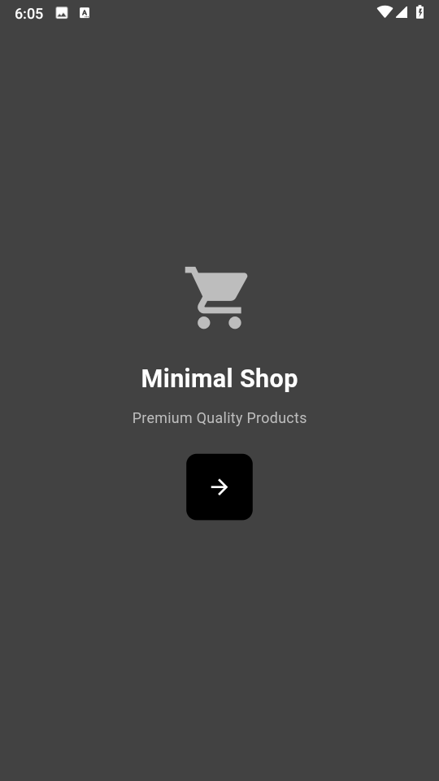
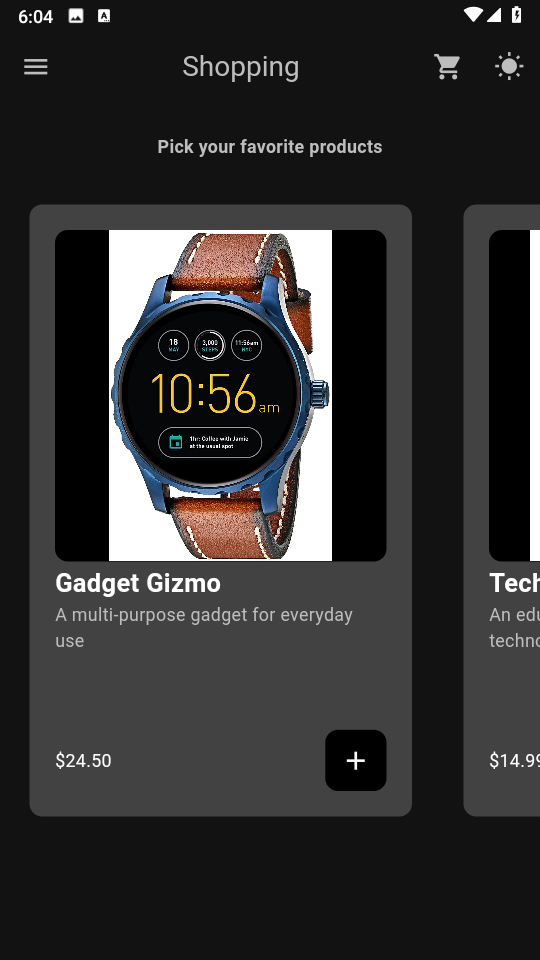
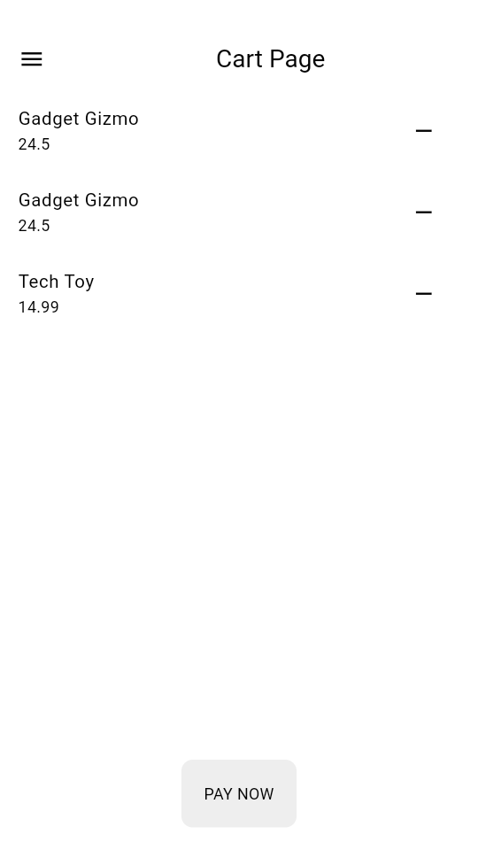

# Shopping App

Shopping App is a Flutter application that allows users to browse and add products to their shopping cart.

 

## Features

- Browse products with images, names, descriptions, and prices
- Add products to the shopping cart

  

- View the current items in the shopping cart
  -implemented dark mode

## Getting Started

To run this project locally, follow these steps:

    1. Make sure you have Flutter installed on your machine. You can find the installation instructions [here](https://flutter.dev/docs/get-started/install).

    2. Clone this repository:
        git clone https://github.com/Chinokoo/shopping_app.git

    3. Navigate to the project directory:
        cd shopping_app
    4. Get the required packages:
        flutter pub get
    5. Run the app:
        flutter run

## Project Structure

    - `lib/main.dart`: The entry point of the application.
    - `lib/pages/`: Contains the main pages of the app (IntroPage, ShopPage, CartPage).
    - `lib/components/`: Contains reusable components used throughout the app (Drawer, ListTile, Button, ProductTile).
    - `lib/models/`: Contains data models (Product, Shop).
    - `lib/themes/`: Contains the theme data for the app (light_theme.dart).
    - `android/`, `ios/`, `linux/`, `macos/`, `web/`, `windows/`: Platform-specific files and configurations.

## Dependencies

This project uses the following dependencies:

    - `flutter/material.dart`: The Material Design library for building UI components.
    - `provider/provider.dart`: A state management library for Flutter.

## Contributing

Contributions are welcome! If you find any issues or have suggestions for improvements, please open an issue or submit a pull request.

